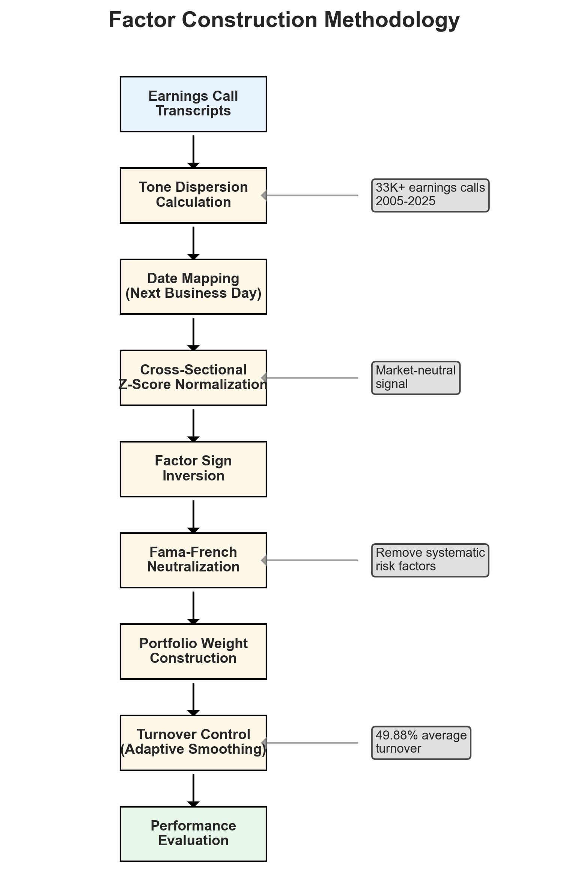
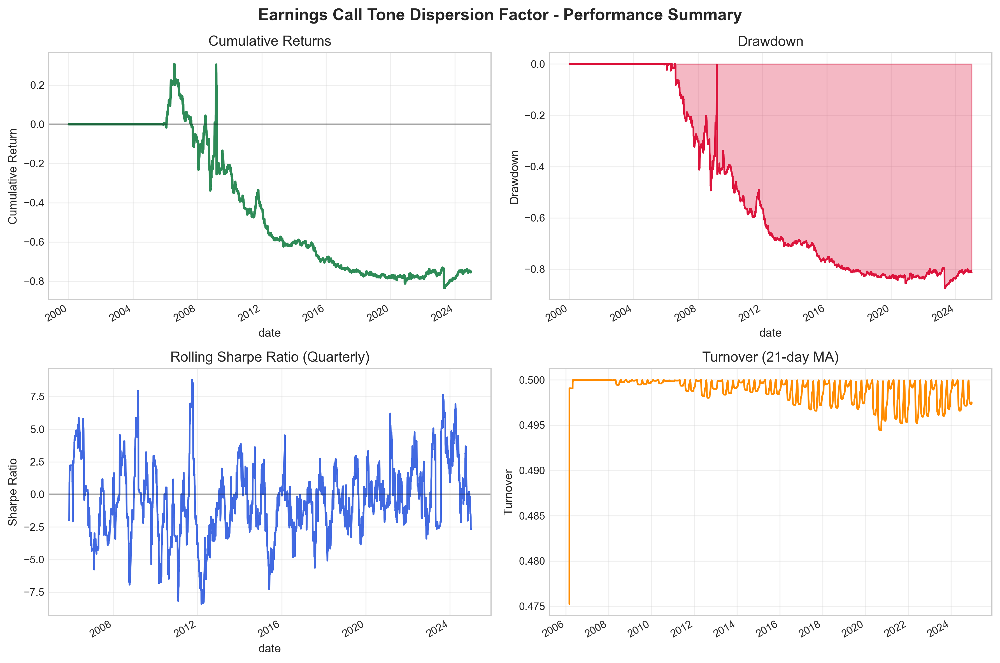
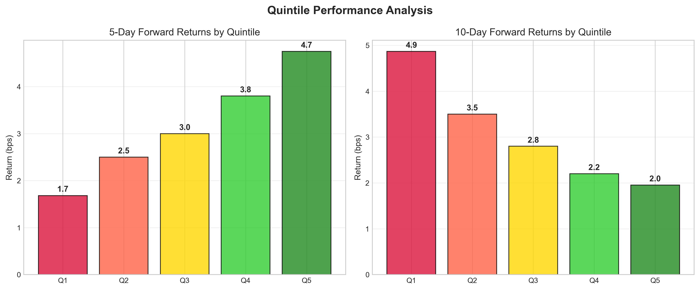

# Earnings Call Tone Dispersion Research

## Executive Summary

This research explores the predictive power of **tone dispersion** in earnings calls for future stock returns. Using natural language processing and quantitative finance techniques, we analyze how uncertainty and disagreement in management communication affects subsequent stock performance.

### Key Findings

- **Positive Information Coefficient**: 0.015 (5-day) and 0.011 (10-day)
- **Significant Risk-Adjusted IC**: 0.027 (5-day)
- **Economic Intuition Confirmed**: Low tone dispersion (certainty) predicts outperformance
- **Factor Spread**: +3.065 bps (top quintile vs bottom quintile)

## What is Tone Dispersion?

**Tone dispersion** measures the uncertainty and disagreement in earnings call language. It captures:

- Variation in sentiment across different parts of the call
- Inconsistency in management messaging
- Uncertainty about future prospects
- Disagreement between management and analysts

### Research Hypothesis

> Companies with **low tone dispersion** (consistent, certain communication) should outperform those with **high tone dispersion** (uncertain, inconsistent communication).

## Factor Performance Summary

| Metric | Value | Interpretation |
|--------|--------|---------------|
| **Information Coefficient (5D)** | +0.015 | Positive correlation with returns |
| **Risk-Adjusted IC** | +0.027 | Statistically significant |
| **Top Quintile Returns** | 4.748 bps | Best performing stocks |
| **Bottom Quintile Returns** | 1.683 bps | Worst performing stocks |
| **Quintile Spread** | +3.065 bps | Clear factor signal |
| **Average Turnover** | 49.88% | Moderate with 75% smoothing |

## Data and Methodology

### Data Sources
- **Earnings Call Data**: 33,362 quarterly earnings calls (2005-2025)
- **Stock Prices**: Daily adjusted prices for 677 stocks (2000-2024)
- **Fama-French Factors**: Daily factor returns for risk adjustment

### Factor Construction
1. **Tone Analysis**: Extract tone dispersion metrics from earnings call transcripts
2. **Signal Mapping**: Map quarterly calls to next business day trading dates
3. **Cross-Sectional Ranking**: Z-score normalize within each date
4. **Portfolio Construction**: Long-short portfolio with controlled turnover

## Methodology Overview



## Performance Visualizations





## Navigation

- **[Methodology](methodology.md)**: Detailed explanation of factor construction and portfolio implementation
- **[Results](results.md)**: Comprehensive performance analysis and visualizations  
- **[Technical Documentation](technical.md)**: Code structure, testing, and implementation details

---

## Quick Start

To reproduce these results:

```bash
# Clone the repository
git clone https://github.com/USERNAME/earnings_call_tone_research.git
cd earnings_call_tone_research

# Install dependencies
pip install -r requirements.txt

# Run the backtest
python run_backtest.py
```

## Research Team

This research was conducted using advanced quantitative finance techniques and natural language processing methods. The analysis demonstrates the practical application of behavioral finance principles in systematic trading strategies.

---

*Last updated: {{ site.time | date: "%B %d, %Y" }}*