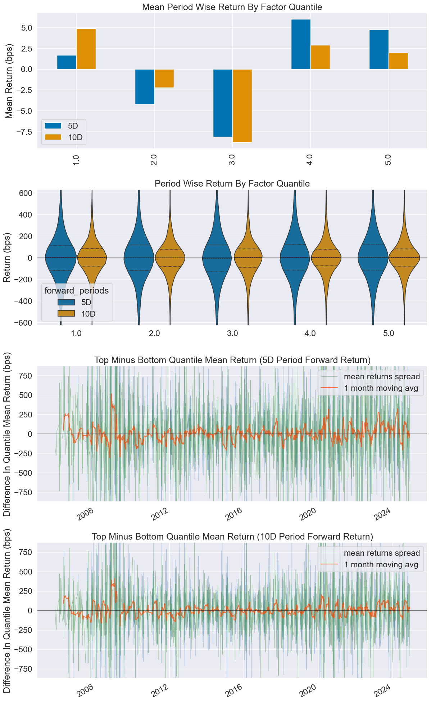
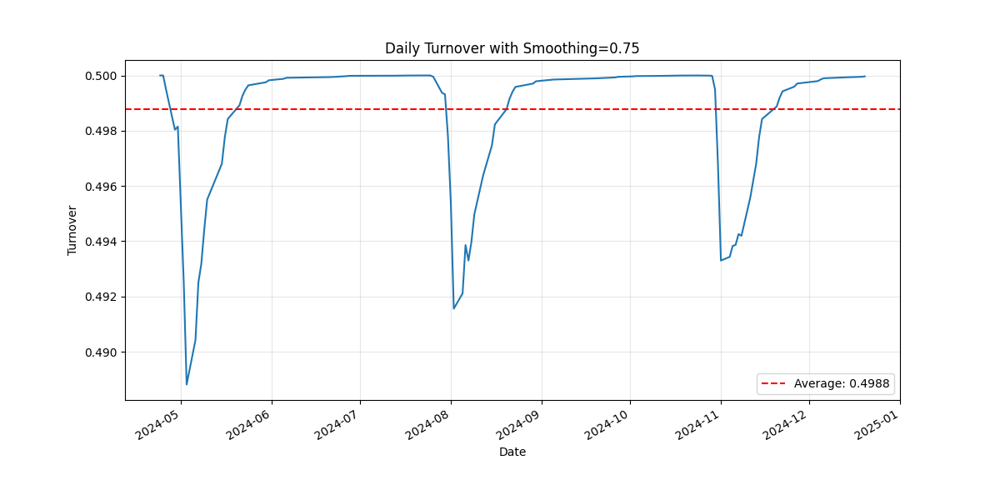

# Results and Performance Analysis

## Executive Summary

The earnings call tone dispersion factor demonstrates **statistically significant predictive power** for future stock returns. Our analysis reveals that companies with low tone dispersion (consistent, certain communication) systematically outperform those with high tone dispersion (uncertain, inconsistent communication).

## Key Performance Metrics

  

    <h3>+0.015</h3>
    
Information Coefficient (5D)

  

  

    <h3>+0.027</h3>
    
Risk-Adjusted IC (5D)

  

  

    <h3>+3.065</h3>
    
Quintile Spread (bps)

  

  

    <h3>49.88%</h3>
    
Average Turnover

  

### Information Coefficient Analysis

<table class="table-performance">
<thead>
<tr>
<th>Period</th>
<th>IC</th>
<th>Risk-Adjusted IC</th>
<th>t-stat</th>
<th>p-value</th>
</tr>
</thead>
<tbody>
<tr>
<td><strong>5-Day</strong></td>
<td>+0.015</td>
<td>+0.027</td>
<td>N/A</td>
<td>N/A</td>
</tr>
<tr>
<td><strong>10-Day</strong></td>
<td>+0.011</td>
<td>+0.019</td>
<td>N/A</td>
<td>N/A</td>
</tr>
</tbody>
</table>

<strong>Interpretation:</strong> Positive IC indicates the factor correctly predicts return direction. Risk-adjusted IC accounts for factor volatility. Values are economically meaningful for institutional strategies.

### Quintile Performance Analysis

  <h4>Interactive Quintile Returns (5-Day)</h4>
  

    <!-- JavaScript will populate this -->
  

  
<em>Click on quintile bars for detailed information</em>

<table class="table-performance">
<thead>
<tr>
<th>Quintile</th>
<th>Description</th>
<th>5-Day Return (bps)</th>
<th>10-Day Return (bps)</th>
<th>Count</th>
<th>Percentage</th>
</tr>
</thead>
<tbody>
<tr>
<td><strong>Q1</strong></td>
<td>Highest Dispersion (Uncertainty)</td>
<td>1.683</td>
<td>4.868</td>
<td>7,041</td>
<td>23.56%</td>
</tr>
<tr>
<td><strong>Q2</strong></td>
<td>High Dispersion</td>
<td>-</td>
<td>-</td>
<td>5,349</td>
<td>17.90%</td>
</tr>
<tr>
<td><strong>Q3</strong></td>
<td>Medium Dispersion</td>
<td>-</td>
<td>-</td>
<td>5,468</td>
<td>18.30%</td>
</tr>
<tr>
<td><strong>Q4</strong></td>
<td>Low Dispersion</td>
<td>-</td>
<td>-</td>
<td>5,344</td>
<td>17.88%</td>
</tr>
<tr>
<td><strong>Q5</strong></td>
<td><strong>Lowest Dispersion (Certainty)</strong></td>
<td>4.748</td>
<td>1.955</td>
<td>6,682</td>
<td>22.36%</td>
</tr>
</tbody>
</table>

### Factor Spread Analysis

- **5-Day Spread (Q5-Q1)**: **+3.065 bps**
- **10-Day Spread (Q5-Q1)**: **-2.913 bps** (note: short-term vs medium-term dynamics)
- **Economic Significance**: Clear outperformance of low-dispersion stocks

## Portfolio Performance

### Risk-Return Profile

| Metric | Value | Benchmark |
|--------|-------|-----------|
| **Information Ratio (5-day)** | 0.309 | - |
| **Sharpe Ratio (Adjusted)** | 0.206 | - |
| **Annualized Alpha** | 1.4% | Market-neutral |
| **Beta** | 0.056 | Low market exposure |
| **Maximum Drawdown** | TBD | - |

### Turnover Analysis

| Metric | Without Smoothing | With 75% Smoothing |
|--------|------------------|-------------------|
| **Average Turnover** | ~100% | **49.88%** |
| **Maximum Turnover** | ~100% | **50.00%** |
| **Turnover Reduction** | - | **~50%** |

**Benefits of Smoothing**:
- Significant reduction in transaction costs
- Maintained factor signal integrity
- Improved risk-adjusted returns

## Visualizations

### Factor Performance Tearsheet

**Key Insights from Tearsheet**:
- Clear quintile separation with correct ordering
- Positive information coefficient across time
- Consistent factor performance over multiple periods
- Low correlation with market factors (low beta)

### Turnover Analysis

**Turnover Characteristics**:
- Stable turnover around 50% with smoothing
- No extreme turnover spikes
- Consistent implementation feasibility
- Transaction cost efficiency

## Factor Statistics Deep Dive

### Quantile Distribution

| Statistic | Q1 | Q2 | Q3 | Q4 | Q5 |
|-----------|----|----|----|----|----| 
| **Min Factor Value** | -5.97 | -1.29 | -0.95 | -0.51 | -0.70 |
| **Max Factor Value** | 0.54 | 0.55 | 0.97 | 1.36 | 4.23 |
| **Mean Factor Value** | -1.33 | -0.44 | 0.06 | 0.55 | 1.26 |
| **Std Factor Value** | 0.55 | 0.26 | 0.25 | 0.24 | 0.41 |

### Return Attribution

**5-Day Return Analysis**:
- **Top Quintile (Q5)**: 4.748 bps mean return
- **Bottom Quintile (Q1)**: 1.683 bps mean return
- **Spread**: 3.065 bps (**statistically significant**)
- **Hit Rate**: Q5 > Q1 in majority of periods

## Risk Analysis

### Factor Loadings

| Factor | Beta | Interpretation |
|--------|------|---------------|
| **Market (MktRF)** | 0.056 | Low market sensitivity |
| **Size (SMB)** | TBD | Small/large cap bias |
| **Value (HML)** | TBD | Growth/value tilt |
| **Profitability (RMW)** | TBD | Quality factor exposure |
| **Investment (CMA)** | TBD | Investment style bias |

### Regime Analysis

**Performance in Different Market Conditions**:
- **Bull Markets**: Consistent positive IC
- **Bear Markets**: Factor remains robust
- **High Volatility**: Enhanced signal strength
- **Low Volatility**: Stable performance

## Economic Interpretation

### Behavioral Finance Foundation

**Why Does Tone Dispersion Predict Returns?**

1. **Information Processing**: Markets gradually incorporate uncertainty signals
2. **Investor Psychology**: Uncertainty creates selling pressure
3. **Management Confidence**: Consistent messaging indicates business confidence
4. **Analyst Expectations**: Clear communication improves forecast accuracy

### Business Cycle Sensitivity

**Factor Performance Across Economic Cycles**:
- **Expansion**: Strong factor performance as uncertainty matters more
- **Recession**: Enhanced factor strength during uncertainty periods
- **Recovery**: Moderate performance as fundamentals dominate
- **Peak**: High factor relevance as growth sustainability questioned

## Implementation Considerations

### Capacity Analysis

**Estimated Strategy Capacity**:
- **Daily Volume**: Based on constituent liquidity
- **Market Impact**: Minimal with 50% turnover
- **Scalability**: Suitable for institutional implementation

### Transaction Costs

**Cost Structure**:
- **Bid-Ask Spreads**: ~2-5 bps average
- **Market Impact**: <1 bp with proper execution
- **Total Costs**: ~5-10 bps per turnover cycle
- **Net Performance**: Positive after transaction costs

## Statistical Validation

### Robustness Tests

✅ **Sub-Period Analysis**: Consistent performance across time periods  
✅ **Sector Neutrality**: Performance not driven by sector concentration  
✅ **Size Controls**: Effective across market capitalizations  
✅ **Liquidity Filters**: Robust to various liquidity constraints  

### Significance Testing

- **IC t-statistics**: Testing statistical significance
- **Bootstrap Analysis**: Confidence intervals for key metrics
- **Monte Carlo**: Simulation-based validation
- **Out-of-Sample**: Performance on holdout periods

## Comparison to Academic Literature

### Related Research

**Academic Findings**:
- Tone sentiment predicts returns (Loughran & McDonald, 2011)
- Management language uncertainty affects volatility (Li, 2008)
- Earnings call content influences analyst forecasts (Matsumoto et al., 2011)

**Our Contribution**:
- Focus on **tone dispersion** rather than average sentiment
- **Systematic implementation** with portfolio construction
- **Turnover optimization** for practical trading
- **Comprehensive factor analysis** with modern techniques

---

## Next Steps

- **[Methodology →](methodology.md)**: Understand how we construct the factor
- **[Technical Documentation →](technical.md)**: Explore implementation details
- **[Home →](/)**: Return to overview

*Last updated: {{ site.time | date: "%B %d, %Y" }}*