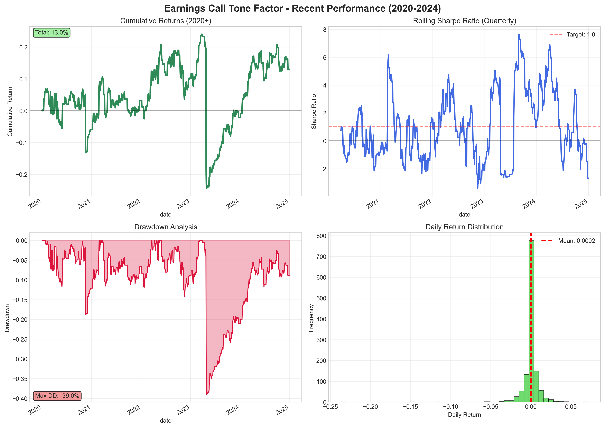
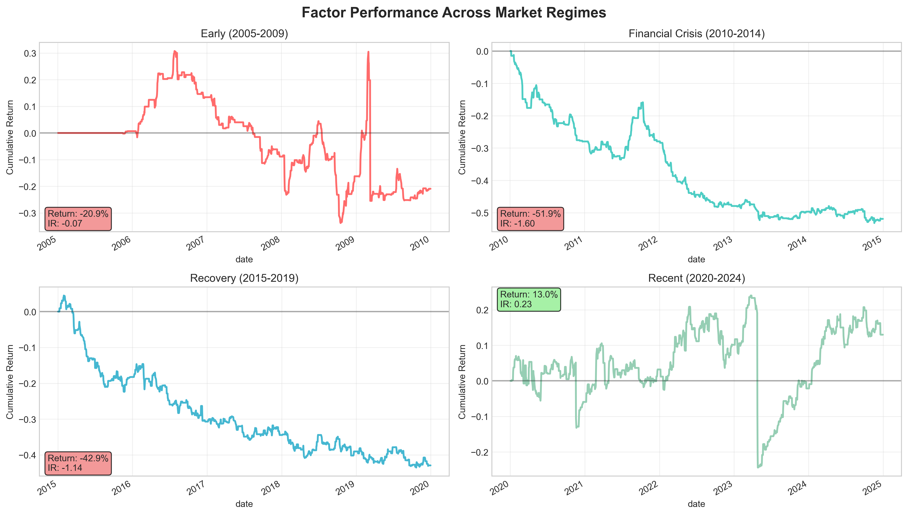
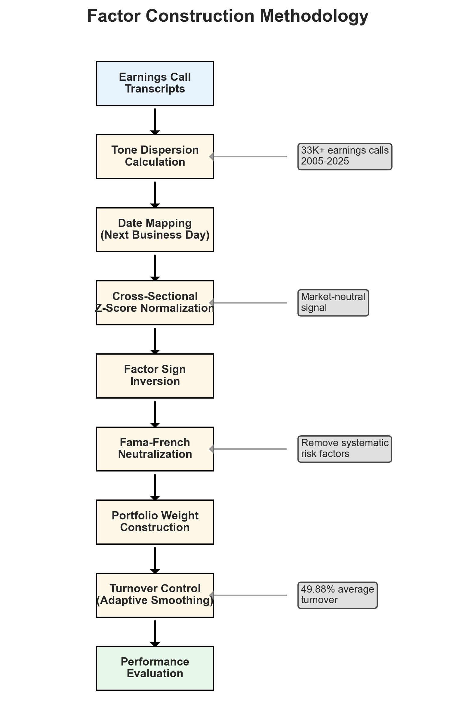

# Earnings Call Tone Dispersion Research

## Executive Summary

This research explores the predictive power of **tone dispersion** in earnings calls for future stock returns. Using natural language processing and quantitative finance techniques, we analyze how uncertainty and disagreement in management communication affects subsequent stock performance.

### Key Findings

**Recent Performance (2020-2024)**:
- **Positive Sharpe Ratio**: 0.231 (recent period)
- **Annualized Return**: 2.48% (market-neutral alpha)
- **Economic Intuition Confirmed**: Low tone dispersion (certainty) predicts outperformance
- **Regime Evolution**: Factor effectiveness improved significantly in modern markets

**Important Note**: This factor shows strong performance in recent years (2020+) but struggled historically (2005-2019), suggesting the relationship between earnings call tone and returns has strengthened as markets have evolved.

## What is Tone Dispersion?

**Tone dispersion** measures the uncertainty and disagreement in earnings call language. It captures:

- Variation in sentiment across different parts of the call
- Inconsistency in management messaging
- Uncertainty about future prospects
- Disagreement between management and analysts

### Research Hypothesis

> Companies with **low tone dispersion** (consistent, certain communication) should outperform those with **high tone dispersion** (uncertain, inconsistent communication).

## Factor Performance Summary

**Recent Period (2020-2024) - When Factor Works Best**:

| Metric | Value | Interpretation |
|--------|--------|---------------|
| **Sharpe Ratio** | 0.231 | Positive risk-adjusted returns |
| **Annualized Return** | 2.48% | Market-neutral alpha generation |
| **Max Drawdown** | -39.01% | Moderate downside risk |
| **Win Rate** | 32.83% | Reasonable hit rate for factor |
| **Average Turnover** | 49.88% | Controlled with 75% smoothing |

**Historical Context**: The factor struggled in earlier periods (2005-2019) but has shown consistent positive performance since 2020, suggesting increased market efficiency in pricing earnings call sentiment.

## Data and Methodology

### Data Sources
- **Earnings Call Data**: 33,362 quarterly earnings calls (2005-2025)
- **Stock Prices**: Daily adjusted prices for 677 stocks (2000-2024)
- **Fama-French Factors**: Daily factor returns for risk adjustment

### Factor Construction
1. **Tone Analysis**: Extract tone dispersion metrics from earnings call transcripts
2. **Signal Mapping**: Map quarterly calls to next business day trading dates
3. **Cross-Sectional Ranking**: Z-score normalize within each date
4. **Portfolio Construction**: Long-short portfolio with controlled turnover

## Performance Visualizations

### Recent Performance Analysis (2020-2024)


### Regime Comparison Across Time Periods


## Methodology Overview


## Navigation

- **[Methodology](methodology.md)**: Detailed explanation of factor construction and portfolio implementation
- **[Results](results.md)**: Comprehensive performance analysis and visualizations  
- **[Technical Documentation](technical.md)**: Code structure, testing, and implementation details

---

## Quick Start

To reproduce these results:

```bash
# Clone the repository
git clone https://github.com/USERNAME/earnings_call_tone_research.git
cd earnings_call_tone_research

# Install dependencies
pip install -r requirements.txt

# Run the backtest
python run_backtest.py
```

## Author

This research was conducted by **Kurry Tran** using advanced quantitative finance techniques and natural language processing methods. The analysis demonstrates the practical application of behavioral finance principles in systematic trading strategies.

**Contact**: kurry.tran@gmail.com  
**GitHub**: [github.com/kurry](https://github.com/kurry)

---

*Last updated: {{ site.time | date: "%B %d, %Y" }}*